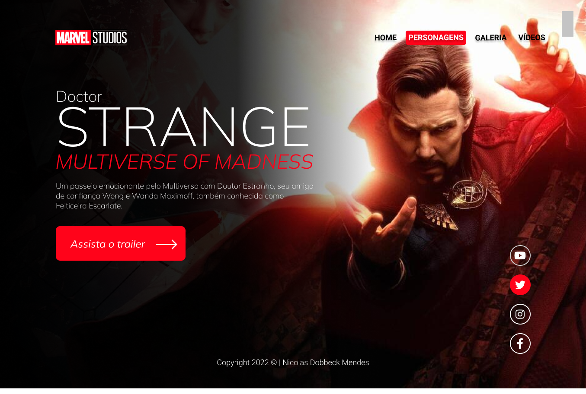
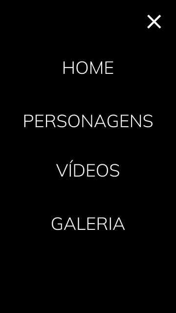

# Doctor Strange-2022
Projeto construido durante as aula de LIMA no curso de Desinvolvimento de Sistemas do [SENAI Jndira](https://jandira.sp.senai.br/), com orientação do professor [Fernado Leonid](https://github.com/fernandoleonid)

 

---
## Qual era o objetivo do projeto?
O objetivo era criar um landing pagr com base no desing feito no figma, aprendendo a estrutura do HTML, CSS, JS e conceitos de responsivide. 

---

## O que é landing page? 
Landings Pages são páginas com foco principal na conversão de visitantes, assim, essas páginas possuem uma estetica mais minimalistta comparada aos sites tradicionais.

---
## Tecnilogias usasdas
- HTML 5
- CSS 3
- JavaScript
- Figma

---
## Links 
- [Resultado](https://github.com/NicolasDobbeck/Strange-2022)
- [Figma](https://www.figma.com/file/dSTJjHJAFj0ly0Jo9I3igk/Lima-DoctorS?node-id=0%3A1)
- [Código](https://github.com/NicolasDobbeck/Strange-2022/blob/main/strange.html)

---

## Autor 
[Nicolas Dobbeck](https://github.com/NicolasDobbeck)